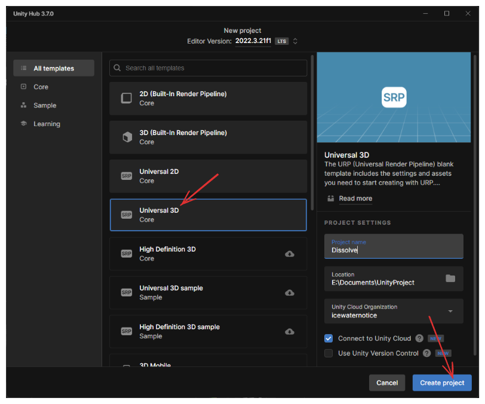

# Unity - Dynamic Shader - Dissolve Effect

## Effect you will get

## Steps

1. Create a new Unity project with Universal 3D.

1. In Project assets Folder, Right click "Create > Shader Graph > BuiltIn > Lit Shader Graph" and name as "Dissolve".

