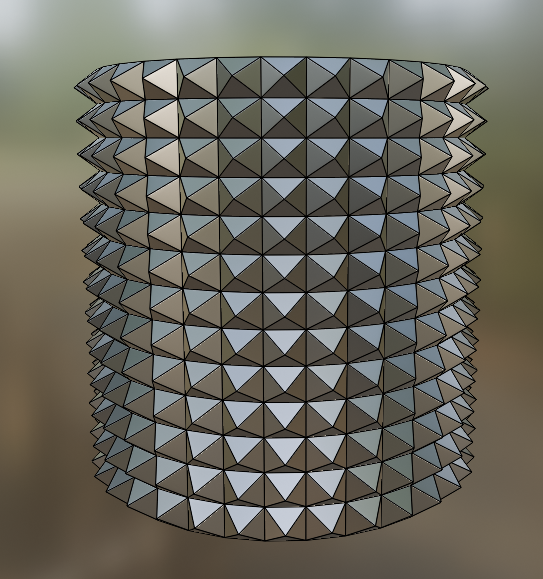
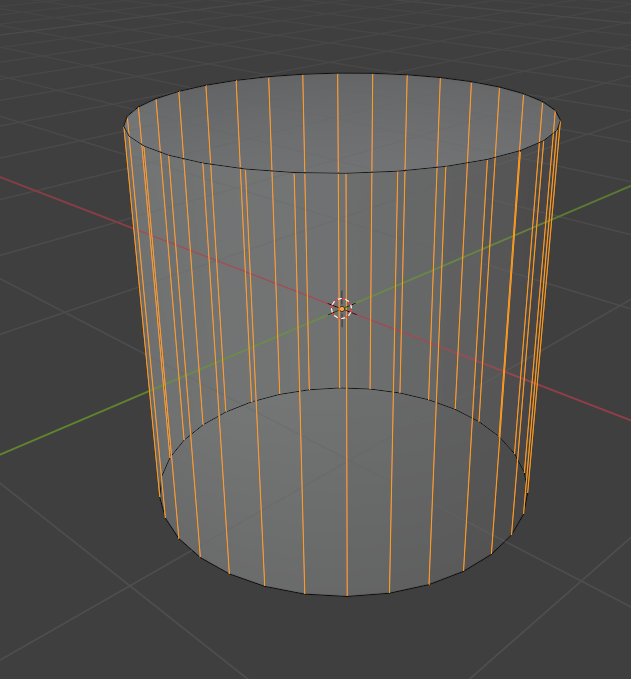
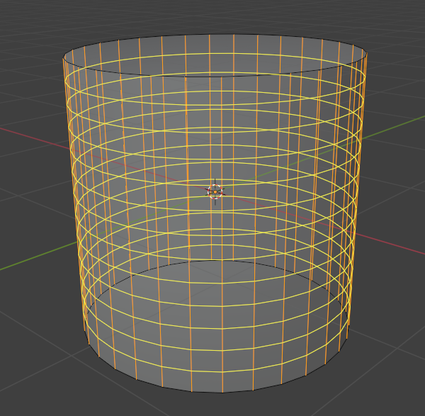
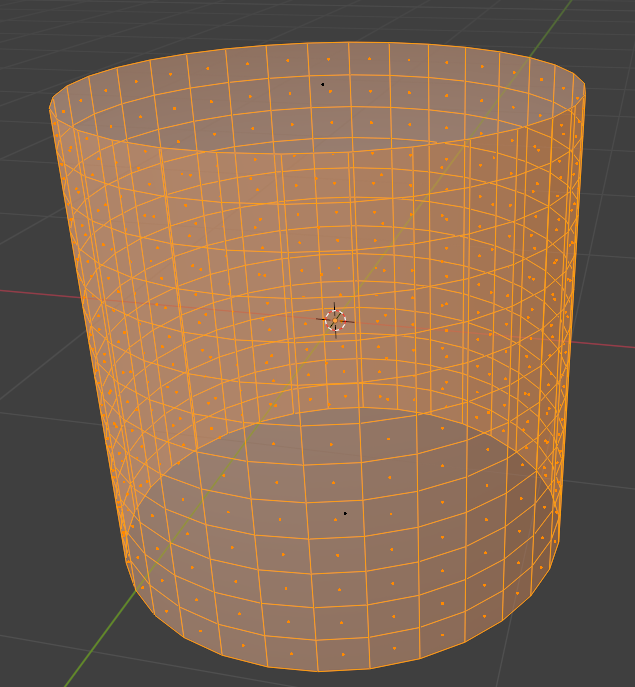
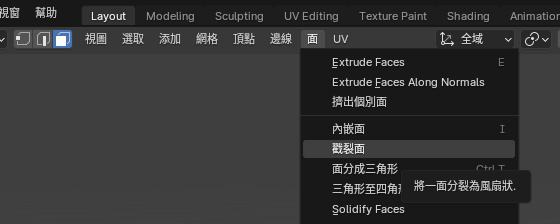
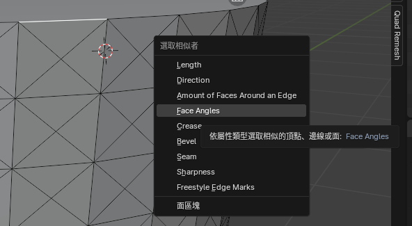
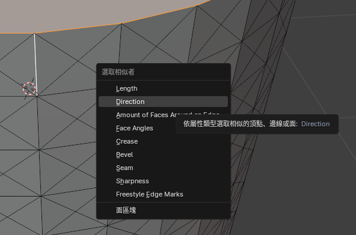
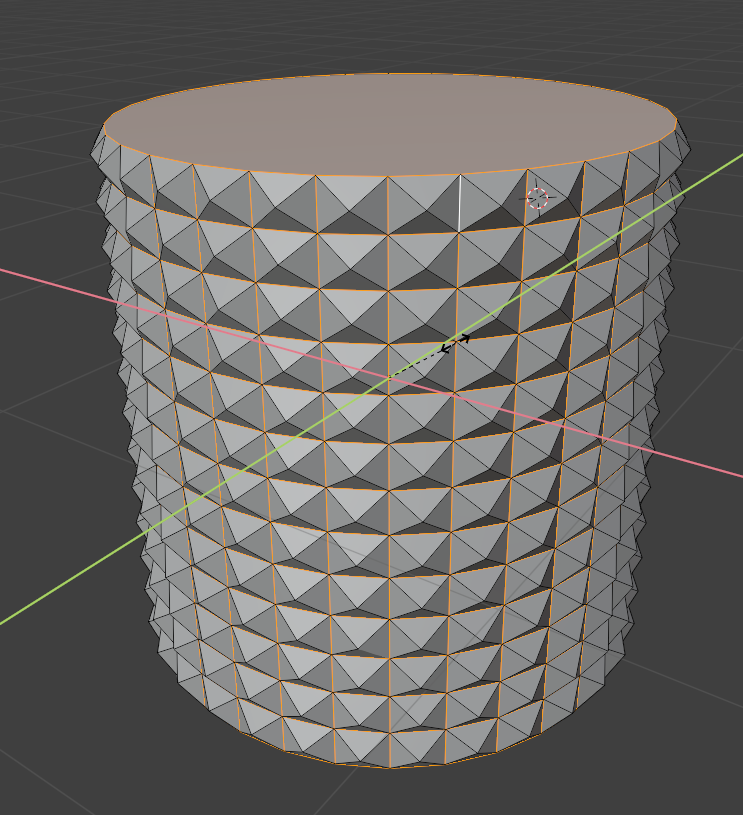

# 輥紋表面

 #Blender

***

## 步驟

1. 建立一個圓柱體
2. 進入編輯模式
3. 選擇垂直線

4. 按 `Ctrl + R` 並滾動滑鼠滾輪

5. 選擇面

6. 面 > 戳裂面

7. 選擇線 > 按 `Shift + G` > 選擇 Face Angles

8. `Shift`選擇線 > 按 `Shift + G` > 選擇 Direction

9. `S` > `Shift + Z` > 拖動滑鼠

