# Unity - Dynamic Shader - Scanline Effect

## Effect you will get

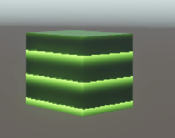

## Steps

1. Create a new Unity project with Universal 3D.
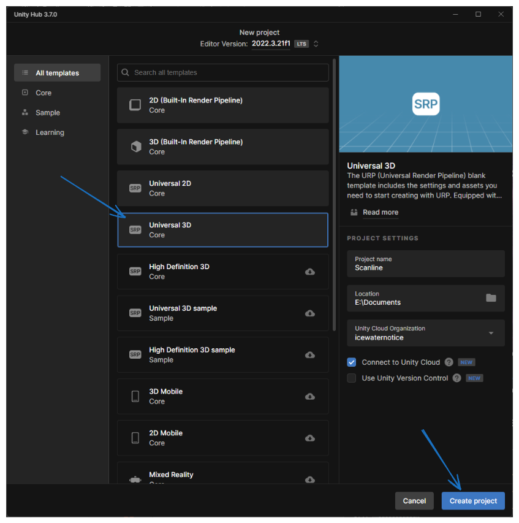
1. In Project assets Folder, Right click "Create > Shader Graph > BuiltIn > Lit Shader Graph" and name as "Scanline".
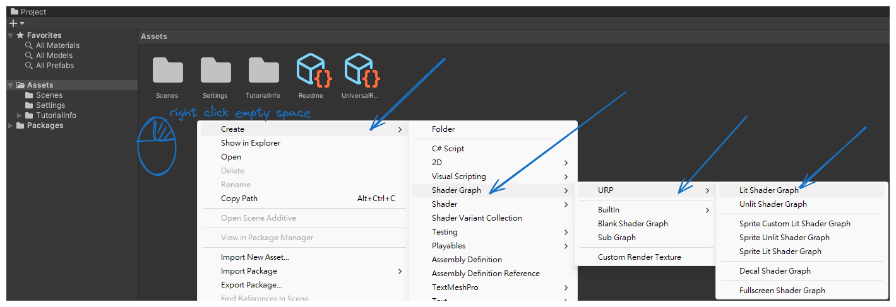
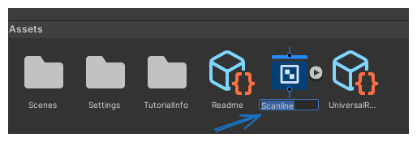
1. Create or import a model to scene, and assign the material to it.
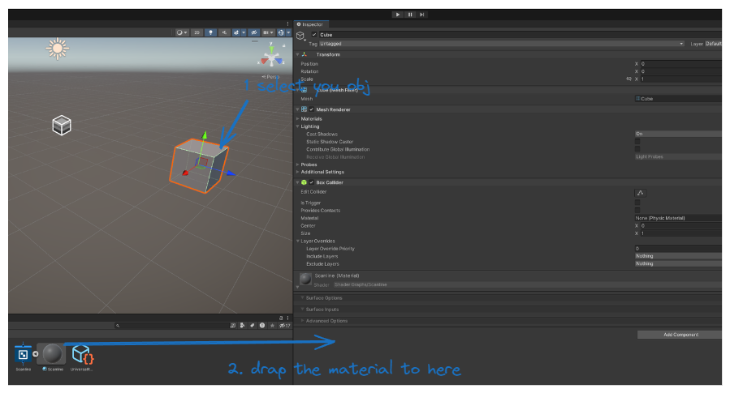
1. Open the "Scanline" shader graph editor.
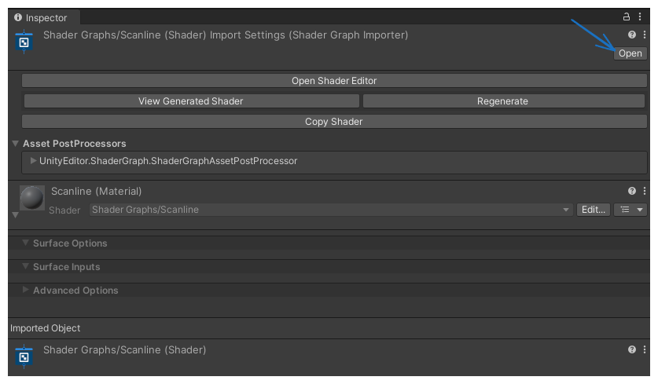
1. Create new nodes
    1. "Input > Geometry > Position"
    1. "Channel > Split"
    1. "Math > Basic > Multiply"
    1. "Math > Range > Fraction"
1. Connect the nodes as shown below.
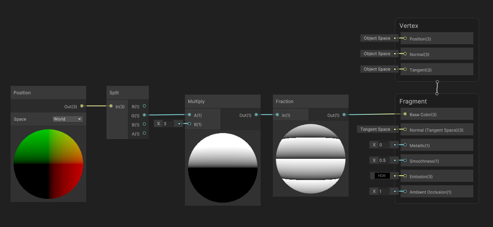
1. save asset
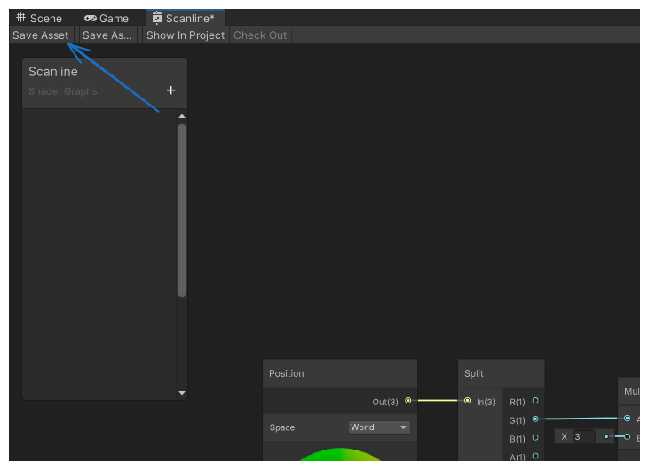
now you can see the scanline effect on the model.
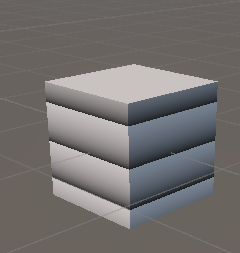
1. Create new nodes
    1. "Input > Basic > Time"
    1. "Math > Basic > Multiply"
    1. "Math > Basic > Add"
1. Connect the nodes as shown below.
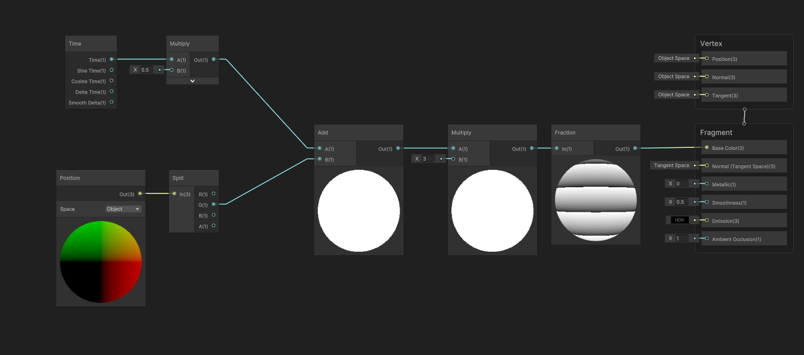
1. save asset

now you can see the scanline effect on the model.
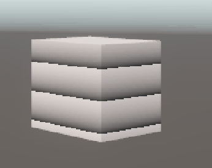
1. Create new nodes
    1. "Input > Basic > Power"
    1. "Input > Basic > Color"
    1. "Math > Basic > Multiply"
1. Connect the nodes as shown below.
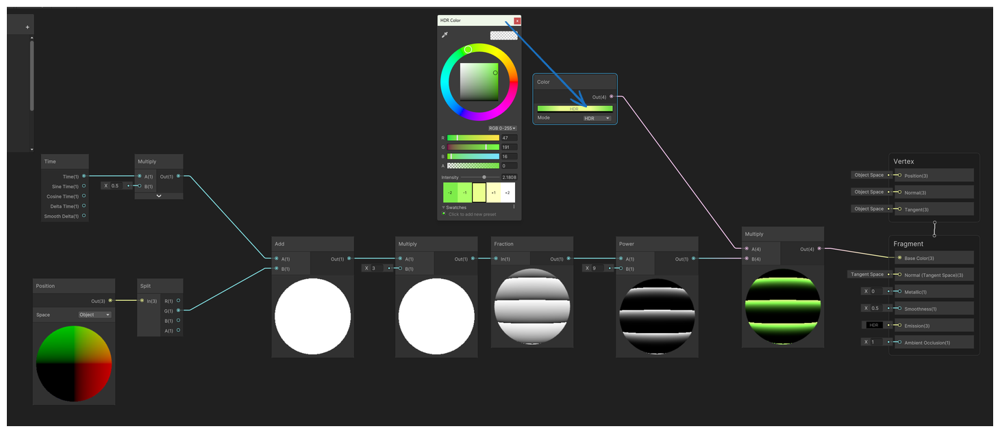
1. save asset

now you can see the scanline effect on the model.

